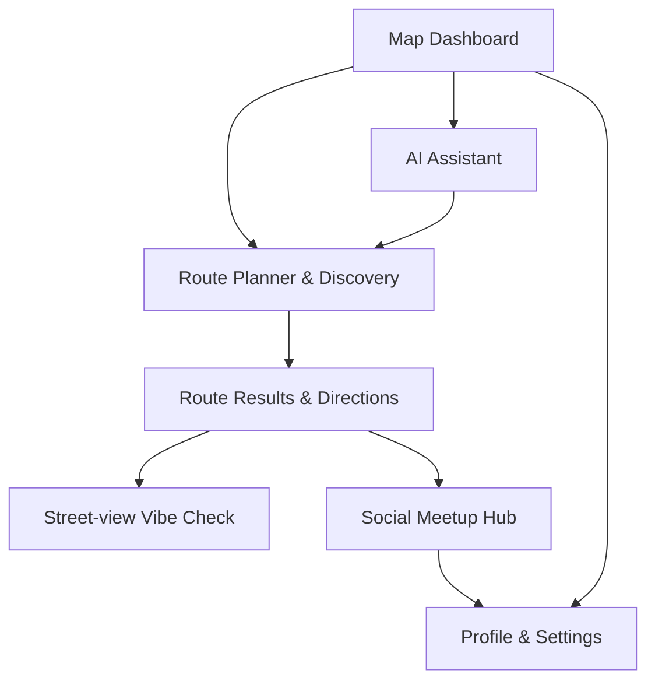

## 1. Product Overview
VibeMap is a React PWA that curates “vibe-first” routes and places in Ho Chi Minh City on an interactive map.
It helps you discover POIs, plan time-boxed itineraries, get directions, and optionally coordinate live meetups.

## 2. Core Features

### 2.1 User Roles
| Role | Registration Method | Core Permissions |
|------|---------------------|------------------|
| Visitor | None | Browse map/discovery, plan routes, view results, use AI assistant, view social sessions |
| Participant (optional) | Enter display name (no account) | Join a live session, send pings, chat in session |

### 2.2 Feature Module
Our requirements consist of the following main pages:
1. **Map Dashboard**: map canvas, search, layer/controls, current route overlay.
2. **Route Planner & Discovery**: origin/destination, time budget, transport mode, “trending” toggle, curated suggestions.
3. **Route Results & Directions**: itinerary on map, stop list, detailed directions, street-view “vibe check”.
4. **AI Assistant**: chat to ask for POIs and generate routes; jump into planning.
5. **Social Meetup Hub**: live session card, participants list/status, session chat and pings.
6. **Profile & Settings**: basic profile (display name/avatar), preferences (theme, map defaults), help links.

### 2.3 Page Details
| Page Name | Module Name | Feature description |
|-----------|-------------|---------------------|
| Map Dashboard | Navigation shell | Switch between Map / Discovery / Social / Profile; open “Plan New Route”. |
| Map Dashboard | Map canvas + overlays | Render map; show route polyline and numbered POI markers; highlight origin/destination. |
| Map Dashboard | Search + filters | Search for places/vibes; open filter/tune panel; show notifications entry point. |
| Map Dashboard | Map controls | Toggle layers/explore/visibility; “my location”; basic zoom/center interactions. |
| Route Planner & Discovery | Plan form | Enter origin/destination; swap points; choose transport mode; set time budget. |
| Route Planner & Discovery | Curation toggles | Include/exclude “Trending on TikTok” style curation toggle when generating routes. |
| Route Planner & Discovery | Generate route | Submit plan request; handle loading/error; navigate to results on success. |
| Route Results & Directions | Results summary | Display route title/summary, total time, and stop list aligned with map markers. |
| Route Results & Directions | Directions view | Show step-by-step directions per leg; allow selecting a leg/stop to focus on map. |
| Route Results & Directions | Street-view vibe check | Show street-view preview for a selected stop/segment; return to results. |
| AI Assistant | Chat + quick prompts | Send messages; render assistant replies; show suggested follow-up chips. |
| AI Assistant | POI cards | Display recommended places with metadata (e.g., rating, trending badge) and CTA to plan route. |
| AI Assistant | Route planning handoff | Convert an assistant suggestion into a filled planner request and navigate to results. |
| Social Meetup Hub | Live session | View active session details (destination, count, map snippet); join session; send ping. |
| Social Meetup Hub | Participants | List participants; show online/ETA badges; start 1:1 chat entry point (stub). |
| Social Meetup Hub | Session chat | View/send short chat messages for the session; show basic delivery/error states. |
| Profile & Settings | Profile basics | View/edit display name and avatar; persist locally. |
| Profile & Settings | Preferences | Toggle theme; set default transport mode/time budget; clear local data/cache. |
| Profile & Settings | Help | Show app version, offline status, and help/FAQ links. |

## 3. Core Process
**Primary planning flow**: You open the Map Dashboard, tap “Plan New Route”, fill in origin/destination plus time budget and transport mode, optionally enable the “Trending” curation toggle, then generate a route. You review the itinerary on the map, open detailed directions for a stop/leg, and optionally open a street-view vibe check.

**AI-assisted flow**: You open AI Assistant, ask for a vibe/POI or request a route, then choose a recommended card to hand off into Route Planner/Results.

**Social flow**: You open Social Meetup Hub, browse an active session, join with a display name, send pings, and chat while navigating.

