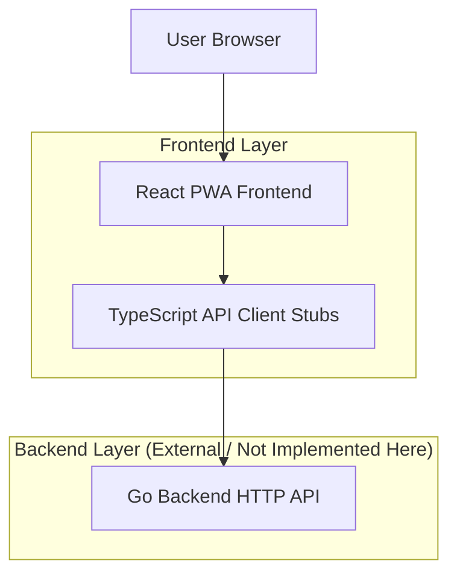

## 1.Architecture design


## 2.Technology Description
- Frontend: React@18 + TypeScript + react-router + tailwindcss@3 + vite
- PWA: Vite PWA plugin (service worker + manifest) + Workbox runtime caching
- API stubs: OpenAPI-first (recommended) + generated TS client (or hand-written typed stubs)
- Backend: Go (external service; API contract only)

## 3.Route definitions
| Route | Purpose |
|-------|---------|
| / | Map Dashboard (map + overlays + global nav) |
| /plan | Route Planner & Discovery (inputs + curated toggles) |
| /results/:routeId | Route Results & Directions (itinerary, directions, vibe check entry) |
| /assistant | AI Assistant (chat + POI cards + plan handoff) |
| /social | Social Meetup Hub (sessions, participants, chat/pings) |
| /profile | Profile & Settings (local profile + preferences) |

## 4.API definitions (If it includes backend services)
### 4.1 Shared TypeScript types (contract)
```ts
export type LatLng = { lat: number; lng: number };

export type TransportMode = "bike" | "car" | "walk" | "bus";

export type Poi = {
  id: string;
  name: string;
  location: LatLng;
  category?: string;
  rating?: number;
  badges?: string[]; // e.g. ["Trending on TikTok"]
};

export type RoutePlanRequest = {
  origin: string;
  destination: string;
  timeBudgetMinutes: number;
  transportMode: TransportMode;
  includeTrending: boolean;
};

export type RouteLeg = {
  fromPoiId?: string;
  toPoiId?: string;
  durationMinutes: number;
  steps: { instruction: string; distanceMeters?: number; durationMinutes?: number }[];
};

export type RoutePlan = {
  id: string;
  title: string;
  pois: Poi[];
  legs: RouteLeg[];
  totalDurationMinutes: number;
};

export type ChatMessage = {
  id: string;
  role: "user" | "assistant";
  text: string;
  createdAt: string; // ISO
};

export type SocialSession = {
  id: string;
  destinationName: string;
  participantCount: number;
  status: "live" | "scheduled" | "ended";
};
```

### 4.2 HTTP endpoints (contract)
Route planning
- `POST /api/routes/plan` -> returns `RoutePlan`

AI assistant
- `POST /api/assistant/messages` -> returns `{ messages: ChatMessage[]; suggestedPois?: Poi[]; suggestedPlan?: Partial<RoutePlanRequest> }`

Social
- `GET /api/social/sessions` -> returns `SocialSession[]`
- `POST /api/social/sessions/:id/join` -> returns `{ participantId: string }`
- `GET /api/social/sessions/:id/messages` -> returns `ChatMessage[]`
- `POST /api/social/sessions/:id/messages` -> returns `ChatMessage`
- `POST /api/social/sessions/:id/ping` -> returns `{ ok: true }`

### 4.3 Frontend stub approach (no backend implementation)
- Define an `ApiClient` interface matching the endpoint contracts.
- Provide two implementations:
  1) `RealApiClient` (fetch-based, points to Go server URL)
  2) `StubApiClient` (in-memory canned responses for local UI development)
- Select implementation via env var (e.g. `VITE_API_MODE=stub|real`).

## 6.Data model(if applicable)
N/A (no database specified; backend is external and out of scope).